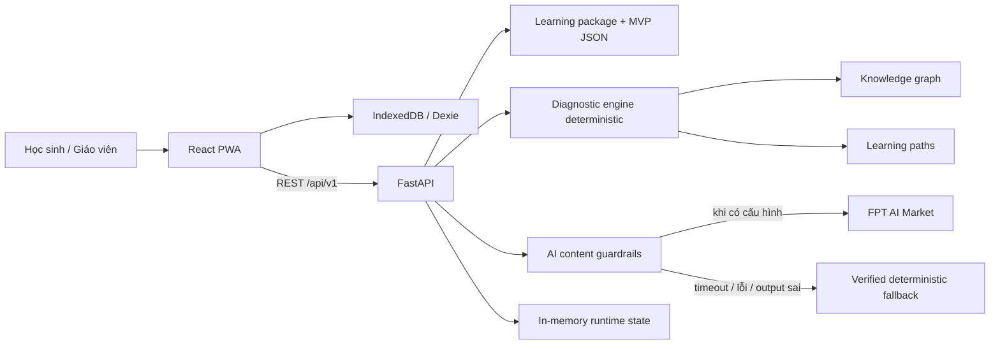

# PeerStudy

PeerStudy là MVP của một hệ thống học tập thích ứng dành cho lớp phổ thông có trình độ học sinh không đồng đều, đặc biệt trong bối cảnh lớp đông hoặc kết nối mạng không ổn định. Thay vì chỉ báo đúng/sai, hệ thống dùng knowledge graph và diagnostic engine deterministic để truy tìm kỹ năng tiên quyết mà học sinh còn thiếu, sau đó đưa học sinh qua một lộ trình phục hồi ngắn trước khi quay lại bài học hiện tại.

MVP tập trung vào chuỗi kiến thức Toán liên lớp: phân số lớp 5, phép toán số hữu tỉ và phương trình chứa phân số lớp 7.

> Nguyên tắc cốt lõi: AI chỉ tạo hoặc diễn giải nội dung. AI không được quyết định `rootGap`, `mastery`, mục tiêu học tập hoặc thay đổi knowledge graph.

## Bài toán và giải pháp

Một học sinh lớp 7 làm sai phương trình chứa phân số chưa chắc yếu về phương trình. Nguyên nhân có thể nằm ở kỹ năng lớp 5 như tạo phân số tương đương hoặc quy đồng mẫu số. PeerStudy giải quyết tình huống này theo chuỗi:

```text
Làm bài mục tiêu
→ phát hiện đáp án sai và error pattern
→ chọn các kỹ năng nghi ngờ từ diagnostic rules
→ hỏi tối đa 4 câu chẩn đoán ngắn
→ phân loại knowledge_gap / careless_mistake / insufficient_evidence
→ nếu có lỗ hổng: gán learning path đã được xác thực
→ giải thích → ví dụ → luyện tập → checkpoint → quay lại bài mục tiêu
→ tổng hợp kết quả cho dashboard giáo viên
```

Luồng demo chính trong dữ liệu MVP:

```text
Minh làm sai E01 — Phương trình chứa phân số
→ ADD_DENOMINATORS
→ chẩn đoán F08 / F11, tham khảo quan hệ gần với F14
→ rootGap = F11 — Quy đồng mẫu số
→ learningPath = lp-001
→ checkpoint CP_F11_001
→ quay lại Q_E01_RETRY_001
```

## Chức năng đã triển khai

### Dành cho học sinh

- Làm câu hỏi mục tiêu, câu chẩn đoán, bài luyện tập và checkpoint.
- Nhận phản hồi theo từng đáp án và error mapping đã được định nghĩa trong learning package.
- Xem kết quả chẩn đoán, lỗ hổng gốc, mức tin cậy và bằng chứng.
- Đi theo lộ trình phục hồi gồm giải thích ngắn, ví dụ mẫu, luyện tập, checkpoint và quay lại bài mục tiêu.
- Yêu cầu FPT AI viết lại giải thích theo kiểu ngắn gọn, từng bước hoặc dễ hình dung.
- Nhận gợi ý từ kết quả chẩn đoán; khi không có AI hợp lệ, hệ thống dùng nội dung fallback đã xác thực.

### Dành cho giáo viên

- Xem tổng quan lớp, trạng thái đồng bộ và các chỉ số trước/sau kiểm tra từ dữ liệu MVP.
- Xem lỗ hổng phổ biến, số học sinh bị ảnh hưởng và các kỹ năng phía sau.
- Xem danh sách học sinh cần ưu tiên.
- Xem nhóm học sinh theo nhu cầu và gợi ý nội dung dạy lại.
- Dashboard được cập nhật từ seed data kết hợp với sự kiện online/offline đã xử lý trong runtime.

### PWA và đồng bộ

- Frontend được build dưới dạng PWA và cache application shell bằng service worker.
- Learning package, phiên chẩn đoán và một số dữ liệu học tập được cache trong IndexedDB qua Dexie.
- Khi mất mạng, câu trả lời được đưa vào hàng đợi cục bộ.
- Khi có mạng trở lại, frontend gửi batch event đến `/api/v1/sync`.
- `eventId` là idempotency key: gửi lại cùng sự kiện không làm thay đổi trạng thái hai lần; dùng lại ID với payload khác bị từ chối.

> Phạm vi offline hiện tại: PWA có thể mở lại tài nguyên đã cache, đọc learning package đã tải và lưu câu trả lời chờ đồng bộ. Diagnostic engine chính đang chạy ở backend và xử lý các attempt offline khi đồng bộ; MVP chưa chạy toàn bộ thuật toán chẩn đoán ngay trên trình duyệt khi mất mạng.

## Kiến trúc



### Ranh giới trách nhiệm

| Thành phần | Trách nhiệm |
|---|---|
| Knowledge graph | Mô tả quan hệ tiên quyết, hỗ trợ và kỹ năng thường bị nhầm lẫn |
| Diagnostic rules | Ánh xạ error pattern sang kỹ năng nghi ngờ và bộ câu hỏi chẩn đoán |
| Diagnostic engine | Chấm đáp án, cập nhật điểm nghi ngờ, phân loại và chọn `rootGap` một cách deterministic |
| Learning package | Nguồn nội dung, validation, error mappings, learning paths và AI templates đã xác thực |
| AI content service | Viết lại giải thích, tạo biến thể câu hỏi, tạo hint; luôn qua source verification và validator |
| Frontend | Hiển thị workflow theo `next.action`, cache dữ liệu, queue và đồng bộ event |
| Dashboard | Tổng hợp seed data với trạng thái runtime để hỗ trợ quyết định của giáo viên |

## Dữ liệu MVP

Thư mục `data/` là nguồn dữ liệu runtime. Gói `math-fractions-v1`, version 3 hiện có:

- 17 kỹ năng: `F02`–`F17`, `R02`, `E01`;
- 25 cạnh knowledge graph;
- 14 câu hỏi thuộc 4 purpose: `target`, `diagnostic`, `practice`, `checkpoint`;
- 5 diagnostic rules;
- 2 learning paths;
- 4 giải thích, 2 worked examples;
- 3 hồ sơ học sinh demo và 3 ground-truth scenarios.

Backend kiểm tra dữ liệu ngay khi khởi động: ID không trùng, reference tồn tại, prerequisite graph không có chu trình và các file runtime không drift so với learning package tổng hợp.

Sơ đồ tham chiếu: [`docs/architecture/knowledge-graph.png`](docs/architecture/knowledge-graph.png).

## Công nghệ

| Lớp | Công nghệ |
|---|---|
| Frontend | React 19, TypeScript, Vite, Tailwind CSS, TanStack Query, Dexie, vite-plugin-pwa, Lucide |
| Backend | Python 3.12, FastAPI, Pydantic, Uvicorn, HTTPX |
| AI provider | FPT AI Market, giao thức chat-completions tương thích OpenAI |
| Test và lint | Pytest, Ruff, Vitest, TypeScript compiler |
| Triển khai | Docker, Nginx, Docker Compose, GHCR, Watchtower, GitHub Actions |

## Cấu trúc repository

```text
PeerStudy/
├── backend/
│   ├── app/
│   │   ├── main.py                 # API, diagnostic engine, sync, dashboard
│   │   ├── data_loader.py          # validate learning package và runtime data
│   │   ├── ai_content_service.py   # source verification, validator, fallback
│   │   ├── fpt_ai_client.py        # client FPT AI Market
│   │   └── models.py               # Pydantic models dùng chung
│   ├── tests/
│   ├── Dockerfile
│   └── pyproject.toml
├── frontend/
│   ├── src/components/student/     # luồng học sinh
│   ├── src/components/teacher/     # dashboard giáo viên
│   ├── src/lib/api.ts              # API client và offline fallback
│   ├── src/lib/db.ts               # IndexedDB / event queue
│   ├── src/types/api.ts            # kiểu dữ liệu theo API contract
│   ├── Dockerfile
│   └── nginx.conf
├── data/                           # nguồn dữ liệu MVP
├── docs/
│   ├── API.txt                     # nguồn sự thật của API contract
│   ├── architecture/knowledge-graph.png
│   └── reference/Checkpoint1.docx  # bối cảnh sản phẩm
├── .github/workflows/ci-cd.yml
├── docker-compose.yml
├── DEPLOYMENT.md
└── AI_EXPLAIINATION.md             # tài liệu chuẩn bị thuyết trình/bảo vệ
```

## Chạy local

### Yêu cầu

- Python 3.12 trở lên;
- Node.js 22 và npm;
- Git.

### 1. Backend

Từ thư mục gốc của repository:

```bash
python -m venv .venv
```

Kích hoạt virtual environment:

```powershell
# Windows PowerShell
.\.venv\Scripts\Activate.ps1
```

```bash
# macOS / Linux
source .venv/bin/activate
```

Cài dependency và chạy API:

```bash
python -m pip install --upgrade pip
python -m pip install -e ./backend pytest ruff
python -m uvicorn backend.app.main:app --reload --port 8000
```

Backend mặc định có tại:

- API: `http://localhost:8000`
- Swagger UI: `http://localhost:8000/docs`
- Health check: `http://localhost:8000/health`

### 2. Frontend

Mở terminal khác:

```bash
cd frontend
npm ci
npm run dev
```

Frontend có tại `http://localhost:4173`. Nếu không đặt `VITE_API_BASE_URL`, frontend local gọi `http://localhost:8000`.

Nếu cần cấu hình riêng:

```bash
# frontend/.env.local
VITE_API_BASE_URL=http://localhost:8000
```

### 3. FPT AI Market — tùy chọn

Hệ thống chạy được khi không có API key và tự dùng fallback deterministic. Để bật provider AI, đặt biến môi trường trước khi khởi động backend:

```dotenv
FPT_AI_API_KEY=your-real-token
FPT_AI_MODEL=your-fpt-market-model-name
FPT_AI_BASE_URL=https://mkp-api.fptcloud.com/chat/completions
FPT_AI_STREAM=true
FPT_AI_TIMEOUT_SECONDS=8
```

Không đưa token vào source code, request frontend, Docker build args hoặc Git.

## Kiểm thử

Từ thư mục gốc:

```bash
pytest
ruff check .
```

Kiểm tra frontend:

```bash
cd frontend
npm test
npm run build
```

Các test chính bao phủ:

- data integrity và drift giữa runtime JSON với learning package;
- API envelope và validation theo `docs/API.txt`;
- luồng chẩn đoán F11, R02, lỗi bất cẩn và trường hợp chưa đủ bằng chứng;
- idempotency giữa attempt online và event offline;
- dashboard cập nhật sau attempt/sync;
- AI source verification, output validator, timeout và fallback;
- frontend API client, offline queue, hint và explanation fallback.

## API chính

Base URL: `/api/v1`

| Method | Endpoint | Mục đích |
|---|---|---|
| `GET` | `/learning-packages/{packageId}` | Lấy gói học tập dùng online/offline |
| `POST` | `/attempts` | Nộp câu trả lời và nhận `next.action` |
| `GET` | `/diagnosis-sessions/{id}` | Đọc trạng thái hoặc kết quả phiên chẩn đoán |
| `GET` | `/classes/{classId}/insights` | Lấy dashboard giáo viên |
| `POST` | `/sync` | Đồng bộ event offline có idempotency |
| `POST` | `/ai/rewrite-explanation` | Viết lại giải thích đã xác thực |
| `POST` | `/ai/generate-question-variant` | Tạo biến thể câu hỏi có validator |
| `POST` | `/ai/generate-diagnosis-hint` | Tạo hint từ kết quả chẩn đoán đã hoàn tất |

Response thành công:

```json
{
  "success": true,
  "data": {}
}
```

Response lỗi:

```json
{
  "success": false,
  "error": {
    "code": "QUESTION_NOT_FOUND",
    "message": "Không tìm thấy câu hỏi",
    "details": {}
  }
}
```

Contract đầy đủ nằm tại [`docs/API.txt`](docs/API.txt). Không tự đổi tên field; frontend điều hướng theo `next.action` thay vì tự suy luận workflow.

## AI an toàn và có thể kiểm soát

Pipeline AI của PeerStudy là một lớp tạo nội dung nằm sau diagnostic engine:

1. Backend lấy source theo `contentId`, `questionId` hoặc `diagnosisSessionId`; client không gửi source text tùy ý.
2. Source được đối chiếu với learning package hoặc kết quả diagnostic engine.
3. Provider chỉ nhận operation, source đã xác thực, style và constraints.
4. Output phải là một JSON object đúng schema.
5. Validator kiểm tra `skillId`, purpose, loại câu hỏi, difficulty, đáp án, option trùng về mặt ngữ nghĩa, error mappings, allowlist và giới hạn mẫu số/từ/câu.
6. Timeout, lỗi mạng, thiếu key, JSON sai hoặc vi phạm constraint đều chuyển sang fallback deterministic nếu có.
7. Response dùng `generated` và `fallbackUsed` để giao diện hiển thị nguồn nội dung rõ ràng.

AI không có quyền ghi mastery, tạo root gap mới hoặc sửa graph.

## Triển khai

CI/CD tại `.github/workflows/ci-cd.yml` thực hiện backend test/lint, frontend build, sau đó publish hai image lên GHCR khi push `main` hoặc chạy workflow thủ công.

Triển khai VPS bằng Docker Compose và Watchtower được mô tả trong [`DEPLOYMENT.md`](DEPLOYMENT.md). Frontend Nginx phục vụ SPA/PWA, proxy `/api/*` và `/health` sang backend.

## Giới hạn của MVP

- Trạng thái backend nằm trong memory và mất khi process/container restart; chưa có database, authentication hoặc multi-tenant.
- Nội dung học tập mới bao phủ một nhánh Toán mẫu, chưa phải toàn bộ Chương trình GDPT 2018.
- Dashboard bắt đầu từ mock/seed data của một lớp 40 học sinh rồi mới ghép với runtime events.
- Công thức mastery và suspicion score là heuristic cố định phục vụ MVP, chưa được hiệu chỉnh trên dữ liệu thực địa quy mô lớn.
- Offline queue đã hoạt động, nhưng diagnostic engine chưa được đóng gói để chạy hoàn toàn trong browser.
- Biến thể câu hỏi AI có API và validator ở backend nhưng chưa có màn hình thao tác riêng trong UI hiện tại.
- Chưa có cơ chế lưu version history cho learning package ngoài trường `version` và kiểm tra mismatch khi sync.

## Tài liệu liên quan

- [`AI_EXPLAIINATION.md`](AI_EXPLAIINATION.md): kịch bản trình bày và trả lời giám khảo.
- [`docs/API.txt`](docs/API.txt): API contract — nguồn sự thật.
- [`data/README.md`](data/README.md): mô tả dữ liệu và golden demo flow.
- [`docs/architecture/knowledge-graph.png`](docs/architecture/knowledge-graph.png): graph kỹ năng phân số.
- [`docs/reference/Checkpoint1.docx`](docs/reference/Checkpoint1.docx): bối cảnh và định hướng sản phẩm.
- [`DEPLOYMENT.md`](DEPLOYMENT.md): hướng dẫn deploy Docker/GHCR/Watchtower.
